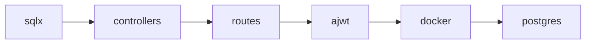

# Golang-Postgresql-Docker-JWT

## TODO
- [ ] Add JWT
- [ ] Add Docker
- [ ] Add Docker Compose

## Diagram
## Project Daily Progress

```mermaid
graph LR;
 sqlx --> controllers --> routes --> ajwt --> docker --> postgres;
```